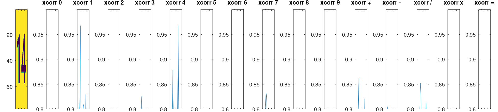

# YT-autoplay-cross-math

A bot to play cross math.
The system consist of 3  individual component

1. A image analyzer that recognizes the game elements from a image.
2. A solver that calculates a solution for solving the puzzle
3. Last something that can apply the above two components to the game running on a phone.

# The game
The game itself is a math puzzle where you need to solve some equations. Below is sample 4 frames from the game at the possible difficulties used to create the image recognizer

```matlab
figure; 
subplot(1,4,1); imshow(imread('images/easy.jpg')); title('Easy');
subplot(1,4,2); imshow(imread('images/medium.jpg')); title('Medium');
subplot(1,4,3); imshow(imread('images/hard.jpg')); title('Hard');
subplot(1,4,4); imshow(imread('images/expert.png')); title('Expert');
print("game-example.png")
```


# Image recognizer
The image recognizer takes an image and spits out the data needed to analyze
- The image solver is made using Octave.
- The templates are created with Octave itself.
- No values was read outside octave, such as colors or positions.

The sequence is the following


## [step0_segment_areas.m](./YTACM-EYE/app/step0_segment_areas.m)
### Detect top and bottom:

### Refine by removing text and circles 


## [step1_find_playfield_method2.m](./YTACM-EYE/app/step1_find_playfield_method2.m)
### Find top grid


## [step2_classify_playfield_box_type.m](./YTACM-EYE/app/step2_classify_playfield_box_type.m)


## [step3_classify_symbols_and_operators.m](./YTACM-EYE/app/step3_classify_symbols_and_operators.m)
This was the most difficult part to get working robustly, in each field we have to find the symbols and combine into a number, I do that by taking the maxim correlation inside each separate region in the field. Response sample below after some filtering to remove mismatches.

- Detection of the symbol '1'

- Detection of the two symbols '1' and '4' inside in field


## [step4_find_variables_rectangles.m](./YTACM-EYE/app/step4_find_variables_rectangles.m)
Detect grid, the detection here, based on a distance transform is super simple. (Most of the code in the file is plotting)


## [step5_classify_available_symbols.m](./YTACM-EYE/app/step5_classify_available_symbols.m)
Classify using same logic as as in step3.

The following is the output
- fieldTypes, 0=bg, 1=input, 2= symbol or operator

Example from using the image 'Easy', the following output is generated (The format is quite verbose but should be readable)

```text
fieldTypes=
   11  6
   0   1   2   2   2   1
   0   0   0   2   0   0
   0   2   0   1   0   0
   2   2   1   2   2   0
   0   2   0   2   0   0
   0   2   0   0   0   0
   0   1   2   1   2   2
   0   0   0   2   0   0
   0   1   2   2   2   2
   0   0   0   2   0   0
   0   0   0   1   0   0
symbolsAtPositions=
21
1,3, + 
1,4, 9 
1,5, = 
2,4, + 
3,2, 22
4,1, 3 
4,2, + 
4,4, = 
4,5, 7 
5,2, 5 
5,4, 27
6,2, = 
7,3, - 
7,5, = 
7,6, 2 
8,4, + 
9,3, + 
9,4, 4 
9,5, = 
9,6, 6 
10,4, =
variables_with_pos=
8
1, 1, 18
1, 2, 18
1, 3, 25
1, 4, 9 
1, 5, 4 
2, 1, 29
2, 2, 2 
2, 3, 27
```