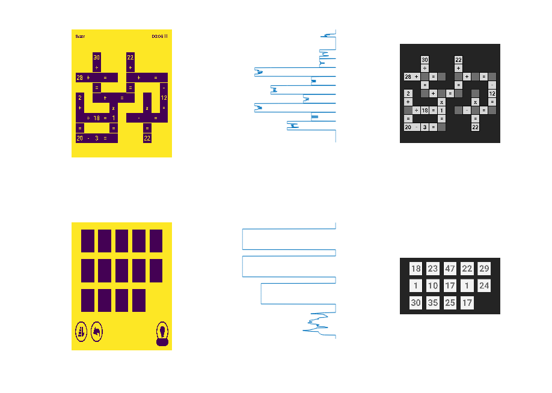
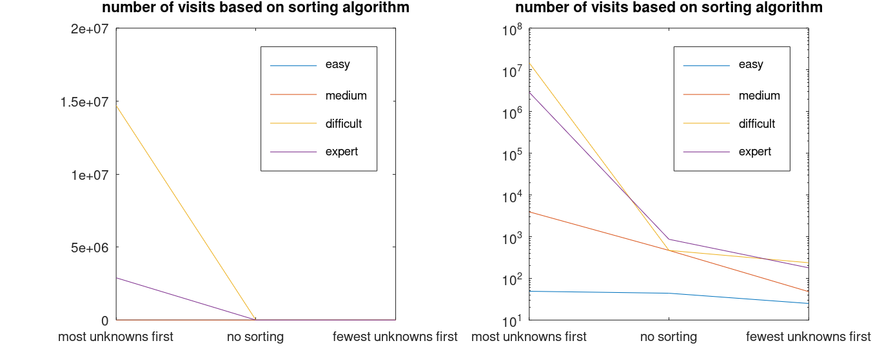

# YT-autoplay-cross-math

A bot to play cross math.
The system consist of 3  individual component

1. A image analyzer that recognizes the game elements from a image.
2. A solver that calculates a solution for solving the puzzle
3. Last something that can apply the above two components to the game running on a phone.

# The game
The game itself is a math puzzle where you need to solve some equations. Below is sample 4 frames from the game at the possible difficulties used to create the image recognizer

```matlab
figure; 
subplot(1,4,1); imshow(imread('images/easy.jpg')); title('Easy');
subplot(1,4,2); imshow(imread('images/medium.jpg')); title('Medium');
subplot(1,4,3); imshow(imread('images/hard.jpg')); title('Hard');
subplot(1,4,4); imshow(imread('images/expert.png')); title('Expert');
print("game-example.png")
```


# Image recognizer
The image recognizer takes an image and spits out the data needed to analyze
- The image solver is made using Octave.
- The templates are created with Octave itself.
- No values was read outside octave, such as colors or positions.

The sequence is the following


## [step0_segment_areas.m](./YTACM-EYE/app/step0_segment_areas.m)
### Detect top and bottom:

### Refine by removing text and circles 



## [step1_find_playfield_method2.m](./YTACM-EYE/app/step1_find_playfield_method2.m)
### Find top grid


## [step2_classify_playfield_box_type.m](./YTACM-EYE/app/step2_classify_playfield_box_type.m)


## [step3_classify_symbols_and_operators.m](./YTACM-EYE/app/step3_classify_symbols_and_operators.m)
This was the most difficult part to get working robustly, in each field we have to find the symbols and combine into a number, I do that by taking the maxim correlation inside each separate region in the field. Response sample below after some filtering to remove mismatches.

- Detection of the symbol '1'

- Detection of the two symbols '1' and '4' inside in field


## [step4_find_variables_rectangles.m](./YTACM-EYE/app/step4_find_variables_rectangles.m)
Detect grid, the detection here, based on a distance transform is super simple. (Most of the code in the file is plotting)


## [step5_classify_available_symbols.m](./YTACM-EYE/app/step5_classify_available_symbols.m)
Classify using same logic as as in step3.

The following is the output
- fieldTypes, 0=bg, 1=input, 2= symbol or operator

Example from using the image 'Easy', the following output is generated (The format is quite verbose but should be readable)

```text
fieldTypes=
   11    6
   0   1   2   2   2   1
   0   0   0   2   0   0
   0   2   0   1   0   0
   2   2   1   2   2   0
   0   2   0   2   0   0
   0   2   0   0   0   0
   0   1   2   1   2   2
   0   0   0   2   0   0
   0   1   2   2   2   2
   0   0   0   2   0   0
   0   0   0   1   0   0
symbolsAtPositions=
21
1,3:+ 
1,4:9 
1,5:= 
2,4:+ 
3,2:22
4,1:3 
4,2:+ 
4,4:= 
4,5:7 
5,2:5 
5,4:27
6,2:= 
7,3:- 
7,5:= 
7,6:2 
8,4:+ 
9,3:+ 
9,4:4 
9,5:= 
9,6:6 
10,4:=
variables_with_pos=
8
1,1:18
1,2:18
1,3:25
1,4:9 
1,5:4 
2,1:29
2,2:2 
2,3:27
```

# Brain
The brain🧠 is used to solve the puzzle🧩 

- Step1, load data
- Step2, detect equations in the matrix (they are just saved as numbers with coordinates and needs to be mapped according to adjacency)
- Step3, Map variables in equations to coordinate system
- Set variables and test for validity, **select equations according to lowest level of freedom to limit test space**

### Optimization note
Selecting according to the lowest level of freedom has a huge effect, the following table shows how the number of visited nodes increased exponentially.
| **Category** | **worst** | **no sorting** | **optimized** | **# variables** |
|--------------|-----------|----------------|---------------|-----------------|
| **expert**   | 2894664   | 854            | 169           | 18              |
| **difficult**| 1747695   | 2336           | 108           | 14              |     
| **medium**   | 3925      | 183            | 40            | 14              |     
| **easy**     | 44        | 44             | 20            | 8               |     



## Solution for easy
 ```time  python solve.py /shared/cross-math-scan-result.txt```
```text
Solution:
[('9+9=18', set()), ('3+4=7', set()), ('27-25=2', set()), ('2+4=6', set()), ('22+5=27', set()), ('9+18=27', set()), ('25+4=29', set())]
{'varname': (0, 5), 'value': '18', 'symIdx': '1,2'}
{'varname': (0, 1), 'value': '9', 'symIdx': '1,4'}
{'varname': (10, 3), 'value': '29', 'symIdx': '2,1'}
{'varname': (2, 3), 'value': '18', 'symIdx': '1,1'}
{'varname': (6, 3), 'value': '25', 'symIdx': '1,3'}
{'varname': (6, 1), 'value': '27', 'symIdx': '2,3'}
{'varname': (8, 1), 'value': '2', 'symIdx': '2,2'}
{'varname': (3, 2), 'value': '4', 'symIdx': '1,5'}

real    0m0.067s
user    0m0.015s
sys     0m0.023s
```

The following diagram shows the path traversed to find the solution


## Solution for medium
```text
Solution:
[('21/3=7', set()), ('18/2=9', set()), ('6+16=22', set()), ('47+19=66', set()), ('14-11=3', set()), ('10+9=19', set()), ('83-27=56', set()), ('23+30=53', set()), ('21+26=47', set()), ('19+8=27', set()), ('23-7=16', set()), ('66-10=56', set()), ('40-18=22', set()), ('11+19=30', set()), ('9-6=3', set())]   
{'varname': (4, 10), 'value': '6', 'symIdx': '2,5'}
{'varname': (4, 2), 'value': '6', 'symIdx': '1,5'}
{'varname': (4, 6), 'value': '22', 'symIdx': '3,2'}
{'varname': (2, 6), 'value': '18', 'symIdx': '2,1'}
{'varname': (2, 10), 'value': '9', 'symIdx': '3,4'}
{'varname': (4, 4), 'value': '16', 'symIdx': '3,3'}
{'varname': (8, 2), 'value': '8', 'symIdx': '2,4'}
{'varname': (2, 2), 'value': '3', 'symIdx': '2,3'}
{'varname': (2, 0), 'value': '21', 'symIdx': '3,1'}
{'varname': (10, 8), 'value': '30', 'symIdx': '1,4'}
{'varname': (10, 4), 'value': '56', 'symIdx': '1,3'}
{'varname': (8, 4), 'value': '10', 'symIdx': '1,1'}
{'varname': (6, 10), 'value': '3', 'symIdx': '1,2'}
{'varname': (6, 4), 'value': '66', 'symIdx': '2,2'}

real    0m0.086s
user    0m0.036s
sys     0m0.024s
```


## Solution for difficult
```text
Solution:
[('28+1=29', set()), ('25+10=35', set()), ('30+17=47', set()), ('18/18=1', set()), ('24-1=23', set()), ('20-3=17', set()), ('2+18=20', set()), ('30/1=30', set()), ('17x1=17', set()), ('22+25=47', set()), ('22x1=22', set()), ('35-12=23', set())]
{'varname': (4, 8), 'value': '22', 'symIdx': '1,4'}
{'varname': (6, 8), 'value': '1', 'symIdx': '2,4'}
{'varname': (6, 6), 'value': '24', 'symIdx': '2,5'}
{'varname': (6, 10), 'value': '23', 'symIdx': '1,2'}
{'varname': (2, 8), 'value': '10', 'symIdx': '2,2'}
{'varname': (2, 10), 'value': '35', 'symIdx': '3,2'}
{'varname': (2, 6), 'value': '25', 'symIdx': '3,3'}
{'varname': (4, 6), 'value': '47', 'symIdx': '1,3'}
{'varname': (4, 2), 'value': '30', 'symIdx': '3,1'}
{'varname': (2, 2), 'value': '1', 'symIdx': '2,1'}
{'varname': (2, 4), 'value': '29', 'symIdx': '1,5'}
{'varname': (4, 4), 'value': '17', 'symIdx': '3,4'}
{'varname': (8, 4), 'value': '17', 'symIdx': '2,3'}
{'varname': (6, 0), 'value': '18', 'symIdx': '1,1'}

real    0m0.057s
user    0m0.030s
sys     0m0.010s
```


## Solution for expert
```text
Solution:
[('11-8=3', set()), ('4+2=6', set()), ('3-2=1', set()), ('21-6=15', set()), ('16-1=15', set()), ('16+7=23', set()), ('118-96=22', set()), ('39/13=3', set()), ('14+21=35', set()), ('11-8=3', set()), ('6x16=96', set()), ('8/4=2', set()), ('15+7=22', set()), ('3-2=1', set()), ('16+23=39', set()), ('6/6=1', set())]
{'varname': (10, 8), 'value': '13', 'symIdx': '1,6'}
{'varname': (10, 6), 'value': '39', 'symIdx': '3,4'}
{'varname': (8, 6), 'value': '23', 'symIdx': '3,3'}
{'varname': (8, 4), 'value': '7', 'symIdx': '2,5'}
{'varname': (8, 2), 'value': '16', 'symIdx': '3,1'}
{'varname': (10, 2), 'value': '96', 'symIdx': '2,4'}
{'varname': (10, 4), 'value': '22', 'symIdx': '3,5'}
{'varname': (6, 10), 'value': '15', 'symIdx': '2,1'}
{'varname': (6, 6), 'value': '16', 'symIdx': '1,2'}
{'varname': (4, 4), 'value': '2', 'symIdx': '1,5'}
{'varname': (4, 2), 'value': '3', 'symIdx': '3,6'}
{'varname': (0, 4), 'value': '8', 'symIdx': '2,6'}
{'varname': (0, 2), 'value': '11', 'symIdx': '1,3'}
{'varname': (4, 8), 'value': '6', 'symIdx': '3,2'}
{'varname': (0, 6), 'value': '3', 'symIdx': '2,3'}
{'varname': (2, 8), 'value': '6', 'symIdx': '2,2'}
{'varname': (2, 6), 'value': '2', 'symIdx': '1,4'}
{'varname': (6, 0), 'value': '21', 'symIdx': '1,1'}

real    0m0.161s
user    0m0.113s
sys     0m0.021s
```

```mermaid
flowchart TD
root-->L1_21m6e15("L1 21-6=15")--✔-->
L1_21m6e15("L1 21-6=15")-->L2_4p16e_2:8_("L2 4+16=_2:8_")--✔-->
L2_4p16e_2:8_("L2 4+16=_2:8_")-->L3_4p16e11("L3 4+16=11")
L3_4p16e11("L3 4+16=11")-->L2_4p16e_2:8_("L2 4+16=_2:8_")
L2_4p16e_2:8_("L2 4+16=_2:8_")-->L3_4p16e2("L3 4+16=2")
L3_4p16e2("L3 4+16=2")-->L2_4p16e_2:8_("L2 4+16=_2:8_")
L2_4p16e_2:8_("L2 4+16=_2:8_")-->L3_4p16e13("L3 4+16=13")
L3_4p16e13("L3 4+16=13")-->L2_4p16e_2:8_("L2 4+16=_2:8_")
L2_4p16e_2:8_("L2 4+16=_2:8_")-->L3_4p16e15("L3 4+16=15")
L3_4p16e15("L3 4+16=15")-->L2_4p16e_2:8_("L2 4+16=_2:8_")
L2_4p16e_2:8_("L2 4+16=_2:8_")-->L3_4p16e6("L3 4+16=6")
L3_4p16e6("L3 4+16=6")-->L2_4p16e_2:8_("L2 4+16=_2:8_")
L2_4p16e_2:8_("L2 4+16=_2:8_")-->L3_4p16e3("L3 4+16=3")
L3_4p16e3("L3 4+16=3")-->L2_4p16e_2:8_("L2 4+16=_2:8_")
L2_4p16e_2:8_("L2 4+16=_2:8_")-->L3_4p16e96("L3 4+16=96")
L3_4p16e96("L3 4+16=96")-->L2_4p16e_2:8_("L2 4+16=_2:8_")
L2_4p16e_2:8_("L2 4+16=_2:8_")-->L3_4p16e7("L3 4+16=7")
L3_4p16e7("L3 4+16=7")-->L2_4p16e_2:8_("L2 4+16=_2:8_")
L2_4p16e_2:8_("L2 4+16=_2:8_")-->L3_4p16e8("L3 4+16=8")
L3_4p16e8("L3 4+16=8")-->L2_4p16e_2:8_("L2 4+16=_2:8_")
L2_4p16e_2:8_("L2 4+16=_2:8_")-->L3_4p16e16("L3 4+16=16")
L3_4p16e16("L3 4+16=16")-->L2_4p16e_2:8_("L2 4+16=_2:8_")
L2_4p16e_2:8_("L2 4+16=_2:8_")-->L3_4p16e23("L3 4+16=23")
L3_4p16e23("L3 4+16=23")-->L2_4p16e_2:8_("L2 4+16=_2:8_")
L2_4p16e_2:8_("L2 4+16=_2:8_")-->L3_4p16e39("L3 4+16=39")
L3_4p16e39("L3 4+16=39")-->L2_4p16e_2:8_("L2 4+16=_2:8_")
L2_4p16e_2:8_("L2 4+16=_2:8_")-->L3_4p16e22("L3 4+16=22")
L3_4p16e22("L3 4+16=22")-->L2_4p16e_2:8_("L2 4+16=_2:8_")

L2_4p16e_2:8_("L2 4+16=_2:8_")-->L1_21m6e15("L1 21-6=15")
L1_21m6e15("L1 21-6=15")-->L2_4p11e_2:8_("L2 4+11=_2:8_")--✔-->
L2_4p11e_2:8_("L2 4+11=_2:8_")-->L3_4p11e16("L3 4+11=16")
L3_4p11e16("L3 4+11=16")-->L2_4p11e_2:8_("L2 4+11=_2:8_")
L2_4p11e_2:8_("L2 4+11=_2:8_")-->L3_4p11e2("L3 4+11=2")
L3_4p11e2("L3 4+11=2")-->L2_4p11e_2:8_("L2 4+11=_2:8_")
L2_4p11e_2:8_("L2 4+11=_2:8_")-->L3_4p11e13("L3 4+11=13")
L3_4p11e13("L3 4+11=13")-->L2_4p11e_2:8_("L2 4+11=_2:8_")
L2_4p11e_2:8_("L2 4+11=_2:8_")-->L3_4p11e15("L3 4+11=15")--✔-->
L3_4p11e15("L3 4+11=15")-->L4_16m11e1("L4 16-11=1")
L4_16m11e1("L4 16-11=1")-->L3_4p11e15("L3 4+11=15")
L3_4p11e15("L3 4+11=15")-->L4_2m11e1("L4 2-11=1")
L4_2m11e1("L4 2-11=1")-->L3_4p11e15("L3 4+11=15")
L3_4p11e15("L3 4+11=15")-->L4_13m11e1("L4 13-11=1")
L4_13m11e1("L4 13-11=1")-->L3_4p11e15("L3 4+11=15")
L3_4p11e15("L3 4+11=15")-->L4_6m11e1("L4 6-11=1")
L4_6m11e1("L4 6-11=1")-->L3_4p11e15("L3 4+11=15")
L3_4p11e15("L3 4+11=15")-->L4_3m11e1("L4 3-11=1")
L4_3m11e1("L4 3-11=1")-->L3_4p11e15("L3 4+11=15")
L3_4p11e15("L3 4+11=15")-->L4_96m11e1("L4 96-11=1")
L4_96m11e1("L4 96-11=1")-->L3_4p11e15("L3 4+11=15")
L3_4p11e15("L3 4+11=15")-->L4_7m11e1("L4 7-11=1")
L4_7m11e1("L4 7-11=1")-->L3_4p11e15("L3 4+11=15")
L3_4p11e15("L3 4+11=15")-->L4_8m11e1("L4 8-11=1")
L4_8m11e1("L4 8-11=1")-->L3_4p11e15("L3 4+11=15")
L3_4p11e15("L3 4+11=15")-->L4_23m11e1("L4 23-11=1")
L4_23m11e1("L4 23-11=1")-->L3_4p11e15("L3 4+11=15")
L3_4p11e15("L3 4+11=15")-->L4_39m11e1("L4 39-11=1")
L4_39m11e1("L4 39-11=1")-->L3_4p11e15("L3 4+11=15")
L3_4p11e15("L3 4+11=15")-->L4_22m11e1("L4 22-11=1")
L4_22m11e1("L4 22-11=1")-->L3_4p11e15("L3 4+11=15")

L3_4p11e15("L3 4+11=15")-->L2_4p11e_2:8_("L2 4+11=_2:8_")
L2_4p11e_2:8_("L2 4+11=_2:8_")-->L3_4p11e6("L3 4+11=6")
L3_4p11e6("L3 4+11=6")-->L2_4p11e_2:8_("L2 4+11=_2:8_")
L2_4p11e_2:8_("L2 4+11=_2:8_")-->L3_4p11e3("L3 4+11=3")
L3_4p11e3("L3 4+11=3")-->L2_4p11e_2:8_("L2 4+11=_2:8_")
L2_4p11e_2:8_("L2 4+11=_2:8_")-->L3_4p11e96("L3 4+11=96")
L3_4p11e96("L3 4+11=96")-->L2_4p11e_2:8_("L2 4+11=_2:8_")
L2_4p11e_2:8_("L2 4+11=_2:8_")-->L3_4p11e7("L3 4+11=7")
L3_4p11e7("L3 4+11=7")-->L2_4p11e_2:8_("L2 4+11=_2:8_")
L2_4p11e_2:8_("L2 4+11=_2:8_")-->L3_4p11e8("L3 4+11=8")
L3_4p11e8("L3 4+11=8")-->L2_4p11e_2:8_("L2 4+11=_2:8_")
L2_4p11e_2:8_("L2 4+11=_2:8_")-->L3_4p11e23("L3 4+11=23")
L3_4p11e23("L3 4+11=23")-->L2_4p11e_2:8_("L2 4+11=_2:8_")
L2_4p11e_2:8_("L2 4+11=_2:8_")-->L3_4p11e39("L3 4+11=39")
L3_4p11e39("L3 4+11=39")-->L2_4p11e_2:8_("L2 4+11=_2:8_")
L2_4p11e_2:8_("L2 4+11=_2:8_")-->L3_4p11e22("L3 4+11=22")
L3_4p11e22("L3 4+11=22")-->L2_4p11e_2:8_("L2 4+11=_2:8_")

L2_4p11e_2:8_("L2 4+11=_2:8_")-->L1_21m6e15("L1 21-6=15")
L1_21m6e15("L1 21-6=15")-->L2_4p2e_2:8_("L2 4+2=_2:8_")--✔-->
L2_4p2e_2:8_("L2 4+2=_2:8_")-->L3_4p2e16("L3 4+2=16")
L3_4p2e16("L3 4+2=16")-->L2_4p2e_2:8_("L2 4+2=_2:8_")
L2_4p2e_2:8_("L2 4+2=_2:8_")-->L3_4p2e11("L3 4+2=11")
L3_4p2e11("L3 4+2=11")-->L2_4p2e_2:8_("L2 4+2=_2:8_")
L2_4p2e_2:8_("L2 4+2=_2:8_")-->L3_4p2e2("L3 4+2=2")
L3_4p2e2("L3 4+2=2")-->L2_4p2e_2:8_("L2 4+2=_2:8_")
L2_4p2e_2:8_("L2 4+2=_2:8_")-->L3_4p2e13("L3 4+2=13")
L3_4p2e13("L3 4+2=13")-->L2_4p2e_2:8_("L2 4+2=_2:8_")
L2_4p2e_2:8_("L2 4+2=_2:8_")-->L3_4p2e15("L3 4+2=15")
L3_4p2e15("L3 4+2=15")-->L2_4p2e_2:8_("L2 4+2=_2:8_")
L2_4p2e_2:8_("L2 4+2=_2:8_")-->L3_4p2e6("L3 4+2=6")--✔-->
L3_4p2e6("L3 4+2=6")-->L4_16m2e1("L4 16-2=1")
L4_16m2e1("L4 16-2=1")-->L3_4p2e6("L3 4+2=6")
L3_4p2e6("L3 4+2=6")-->L4_11m2e1("L4 11-2=1")
L4_11m2e1("L4 11-2=1")-->L3_4p2e6("L3 4+2=6")
L3_4p2e6("L3 4+2=6")-->L4_2m2e1("L4 2-2=1")
L4_2m2e1("L4 2-2=1")-->L3_4p2e6("L3 4+2=6")
L3_4p2e6("L3 4+2=6")-->L4_13m2e1("L4 13-2=1")
L4_13m2e1("L4 13-2=1")-->L3_4p2e6("L3 4+2=6")
L3_4p2e6("L3 4+2=6")-->L4_15m2e1("L4 15-2=1")
L4_15m2e1("L4 15-2=1")-->L3_4p2e6("L3 4+2=6")
L3_4p2e6("L3 4+2=6")-->L4_3m2e1("L4 3-2=1")--✔-->
L4_3m2e1("L4 3-2=1")-->L5_6s16e1("L5 6/16=1")
L5_6s16e1("L5 6/16=1")-->L4_3m2e1("L4 3-2=1")
L4_3m2e1("L4 3-2=1")-->L5_6s11e1("L5 6/11=1")
L5_6s11e1("L5 6/11=1")-->L4_3m2e1("L4 3-2=1")
L4_3m2e1("L4 3-2=1")-->L5_6s2e1("L5 6/2=1")
L5_6s2e1("L5 6/2=1")-->L4_3m2e1("L4 3-2=1")
L4_3m2e1("L4 3-2=1")-->L5_6s13e1("L5 6/13=1")
L5_6s13e1("L5 6/13=1")-->L4_3m2e1("L4 3-2=1")
L4_3m2e1("L4 3-2=1")-->L5_6s15e1("L5 6/15=1")
L5_6s15e1("L5 6/15=1")-->L4_3m2e1("L4 3-2=1")
L4_3m2e1("L4 3-2=1")-->L5_6s96e1("L5 6/96=1")
L5_6s96e1("L5 6/96=1")-->L4_3m2e1("L4 3-2=1")
L4_3m2e1("L4 3-2=1")-->L5_6s7e1("L5 6/7=1")
L5_6s7e1("L5 6/7=1")-->L4_3m2e1("L4 3-2=1")
L4_3m2e1("L4 3-2=1")-->L5_6s8e1("L5 6/8=1")
L5_6s8e1("L5 6/8=1")-->L4_3m2e1("L4 3-2=1")
L4_3m2e1("L4 3-2=1")-->L5_6s6e1("L5 6/6=1")--✔-->
L5_6s6e1("L5 6/6=1")-->L6_16m_0:4_e3("L6 16-_0:4_=3")--✔-->
L6_16m_0:4_e3("L6 16-_0:4_=3")-->L7_16m11e3("L7 16-11=3")
L7_16m11e3("L7 16-11=3")-->L6_16m_0:4_e3("L6 16-_0:4_=3")
L6_16m_0:4_e3("L6 16-_0:4_=3")-->L7_16m2e3("L7 16-2=3")
L7_16m2e3("L7 16-2=3")-->L6_16m_0:4_e3("L6 16-_0:4_=3")
L6_16m_0:4_e3("L6 16-_0:4_=3")-->L7_16m13e3("L7 16-13=3")--✔-->
L7_16m13e3("L7 16-13=3")-->L8_16m8e11("L8 16-8=11")
L8_16m8e11("L8 16-8=11")-->L7_16m13e3("L7 16-13=3")
L7_16m13e3("L7 16-13=3")-->L8_16m8e2("L8 16-8=2")
L8_16m8e2("L8 16-8=2")-->L7_16m13e3("L7 16-13=3")
L7_16m13e3("L7 16-13=3")-->L8_16m8e15("L8 16-8=15")
L8_16m8e15("L8 16-8=15")-->L7_16m13e3("L7 16-13=3")
L7_16m13e3("L7 16-13=3")-->L8_16m8e96("L8 16-8=96")
L8_16m8e96("L8 16-8=96")-->L7_16m13e3("L7 16-13=3")
L7_16m13e3("L7 16-13=3")-->L8_16m8e7("L8 16-8=7")
L8_16m8e7("L8 16-8=7")-->L7_16m13e3("L7 16-13=3")
L7_16m13e3("L7 16-13=3")-->L8_16m8e8("L8 16-8=8")--✔-->
L8_16m8e8("L8 16-8=8")-->L9_8m11e1("L9 8-11=1")
L9_8m11e1("L9 8-11=1")-->L8_16m8e8("L8 16-8=8")
L8_16m8e8("L8 16-8=8")-->L9_8m2e1("L9 8-2=1")
L9_8m2e1("L9 8-2=1")-->L8_16m8e8("L8 16-8=8")
L8_16m8e8("L8 16-8=8")-->L9_8m15e1("L9 8-15=1")
L9_8m15e1("L9 8-15=1")-->L8_16m8e8("L8 16-8=8")
L8_16m8e8("L8 16-8=8")-->L9_8m96e1("L9 8-96=1")
L9_8m96e1("L9 8-96=1")-->L8_16m8e8("L8 16-8=8")
L8_16m8e8("L8 16-8=8")-->L9_8m7e1("L9 8-7=1")
L9_8m7e1("L9 8-7=1")-->L8_16m8e8("L8 16-8=8")
L8_16m8e8("L8 16-8=8")-->L9_8m16e1("L9 8-16=1")
L9_8m16e1("L9 8-16=1")-->L8_16m8e8("L8 16-8=8")
L8_16m8e8("L8 16-8=8")-->L9_8m23e1("L9 8-23=1")
L9_8m23e1("L9 8-23=1")-->L8_16m8e8("L8 16-8=8")
L8_16m8e8("L8 16-8=8")-->L9_8m39e1("L9 8-39=1")
L9_8m39e1("L9 8-39=1")-->L8_16m8e8("L8 16-8=8")
L8_16m8e8("L8 16-8=8")-->L9_8m22e1("L9 8-22=1")
L9_8m22e1("L9 8-22=1")-->L8_16m8e8("L8 16-8=8")
L8_16m8e8("L8 16-8=8")-->L9_8m3e1("L9 8-3=1")
L9_8m3e1("L9 8-3=1")-->L8_16m8e8("L8 16-8=8")

L8_16m8e8("L8 16-8=8")-->L7_16m13e3("L7 16-13=3")
L7_16m13e3("L7 16-13=3")-->L8_16m8e16("L8 16-8=16")
L8_16m8e16("L8 16-8=16")-->L7_16m13e3("L7 16-13=3")
L7_16m13e3("L7 16-13=3")-->L8_16m8e23("L8 16-8=23")
L8_16m8e23("L8 16-8=23")-->L7_16m13e3("L7 16-13=3")
L7_16m13e3("L7 16-13=3")-->L8_16m8e39("L8 16-8=39")
L8_16m8e39("L8 16-8=39")-->L7_16m13e3("L7 16-13=3")
L7_16m13e3("L7 16-13=3")-->L8_16m8e22("L8 16-8=22")
L8_16m8e22("L8 16-8=22")-->L7_16m13e3("L7 16-13=3")
L7_16m13e3("L7 16-13=3")-->L8_16m8e3("L8 16-8=3")
L8_16m8e3("L8 16-8=3")-->L7_16m13e3("L7 16-13=3")

L7_16m13e3("L7 16-13=3")-->L6_16m_0:4_e3("L6 16-_0:4_=3")
L6_16m_0:4_e3("L6 16-_0:4_=3")-->L7_16m15e3("L7 16-15=3")
L7_16m15e3("L7 16-15=3")-->L6_16m_0:4_e3("L6 16-_0:4_=3")
L6_16m_0:4_e3("L6 16-_0:4_=3")-->L7_16m96e3("L7 16-96=3")
L7_16m96e3("L7 16-96=3")-->L6_16m_0:4_e3("L6 16-_0:4_=3")
L6_16m_0:4_e3("L6 16-_0:4_=3")-->L7_16m7e3("L7 16-7=3")
L7_16m7e3("L7 16-7=3")-->L6_16m_0:4_e3("L6 16-_0:4_=3")
L6_16m_0:4_e3("L6 16-_0:4_=3")-->L7_16m8e3("L7 16-8=3")
L7_16m8e3("L7 16-8=3")-->L6_16m_0:4_e3("L6 16-_0:4_=3")
L6_16m_0:4_e3("L6 16-_0:4_=3")-->L7_16m16e3("L7 16-16=3")
L7_16m16e3("L7 16-16=3")-->L6_16m_0:4_e3("L6 16-_0:4_=3")
L6_16m_0:4_e3("L6 16-_0:4_=3")-->L7_16m23e3("L7 16-23=3")
L7_16m23e3("L7 16-23=3")-->L6_16m_0:4_e3("L6 16-_0:4_=3")
L6_16m_0:4_e3("L6 16-_0:4_=3")-->L7_16m39e3("L7 16-39=3")
L7_16m39e3("L7 16-39=3")-->L6_16m_0:4_e3("L6 16-_0:4_=3")
L6_16m_0:4_e3("L6 16-_0:4_=3")-->L7_16m22e3("L7 16-22=3")
L7_16m22e3("L7 16-22=3")-->L6_16m_0:4_e3("L6 16-_0:4_=3")
L6_16m_0:4_e3("L6 16-_0:4_=3")-->L7_16m3e3("L7 16-3=3")
L7_16m3e3("L7 16-3=3")-->L6_16m_0:4_e3("L6 16-_0:4_=3")

L6_16m_0:4_e3("L6 16-_0:4_=3")-->L5_6s6e1("L5 6/6=1")
L5_6s6e1("L5 6/6=1")-->L6_11m_0:4_e3("L6 11-_0:4_=3")--✔-->
L6_11m_0:4_e3("L6 11-_0:4_=3")-->L7_11m16e3("L7 11-16=3")
L7_11m16e3("L7 11-16=3")-->L6_11m_0:4_e3("L6 11-_0:4_=3")
L6_11m_0:4_e3("L6 11-_0:4_=3")-->L7_11m2e3("L7 11-2=3")
L7_11m2e3("L7 11-2=3")-->L6_11m_0:4_e3("L6 11-_0:4_=3")
L6_11m_0:4_e3("L6 11-_0:4_=3")-->L7_11m13e3("L7 11-13=3")
L7_11m13e3("L7 11-13=3")-->L6_11m_0:4_e3("L6 11-_0:4_=3")
L6_11m_0:4_e3("L6 11-_0:4_=3")-->L7_11m15e3("L7 11-15=3")
L7_11m15e3("L7 11-15=3")-->L6_11m_0:4_e3("L6 11-_0:4_=3")
L6_11m_0:4_e3("L6 11-_0:4_=3")-->L7_11m96e3("L7 11-96=3")
L7_11m96e3("L7 11-96=3")-->L6_11m_0:4_e3("L6 11-_0:4_=3")
L6_11m_0:4_e3("L6 11-_0:4_=3")-->L7_11m7e3("L7 11-7=3")
L7_11m7e3("L7 11-7=3")-->L6_11m_0:4_e3("L6 11-_0:4_=3")
L6_11m_0:4_e3("L6 11-_0:4_=3")-->L7_11m8e3("L7 11-8=3")--✔-->
L7_11m8e3("L7 11-8=3")-->L8_11m8e16("L8 11-8=16")
L8_11m8e16("L8 11-8=16")-->L7_11m8e3("L7 11-8=3")
L7_11m8e3("L7 11-8=3")-->L8_11m8e2("L8 11-8=2")
L8_11m8e2("L8 11-8=2")-->L7_11m8e3("L7 11-8=3")
L7_11m8e3("L7 11-8=3")-->L8_11m8e13("L8 11-8=13")
L8_11m8e13("L8 11-8=13")-->L7_11m8e3("L7 11-8=3")
L7_11m8e3("L7 11-8=3")-->L8_11m8e15("L8 11-8=15")
L8_11m8e15("L8 11-8=15")-->L7_11m8e3("L7 11-8=3")
L7_11m8e3("L7 11-8=3")-->L8_11m8e96("L8 11-8=96")
L8_11m8e96("L8 11-8=96")-->L7_11m8e3("L7 11-8=3")
L7_11m8e3("L7 11-8=3")-->L8_11m8e7("L8 11-8=7")
L8_11m8e7("L8 11-8=7")-->L7_11m8e3("L7 11-8=3")
L7_11m8e3("L7 11-8=3")-->L8_11m8e23("L8 11-8=23")
L8_11m8e23("L8 11-8=23")-->L7_11m8e3("L7 11-8=3")
L7_11m8e3("L7 11-8=3")-->L8_11m8e39("L8 11-8=39")
L8_11m8e39("L8 11-8=39")-->L7_11m8e3("L7 11-8=3")
L7_11m8e3("L7 11-8=3")-->L8_11m8e22("L8 11-8=22")
L8_11m8e22("L8 11-8=22")-->L7_11m8e3("L7 11-8=3")
L7_11m8e3("L7 11-8=3")-->L8_11m8e3("L8 11-8=3")--✔-->
L8_11m8e3("L8 11-8=3")-->L9_3m16e1("L9 3-16=1")
L9_3m16e1("L9 3-16=1")-->L8_11m8e3("L8 11-8=3")
L8_11m8e3("L8 11-8=3")-->L9_3m2e1("L9 3-2=1")--✔-->
L9_3m2e1("L9 3-2=1")-->L10_16m1e_6:10_("L10 16-1=_6:10_")--✔-->
L10_16m1e_6:10_("L10 16-1=_6:10_")-->L11_16m1e13("L11 16-1=13")
L11_16m1e13("L11 16-1=13")-->L10_16m1e_6:10_("L10 16-1=_6:10_")
L10_16m1e_6:10_("L10 16-1=_6:10_")-->L11_16m1e15("L11 16-1=15")--✔-->
L11_16m1e15("L11 16-1=15")-->L12_118m_10:2_e13("L12 118-_10:2_=13")--✔-->
L12_118m_10:2_e13("L12 118-_10:2_=13")-->L13_118m96e13("L13 118-96=13")
L13_118m96e13("L13 118-96=13")-->L12_118m_10:2_e13("L12 118-_10:2_=13")
L12_118m_10:2_e13("L12 118-_10:2_=13")-->L13_118m7e13("L13 118-7=13")
L13_118m7e13("L13 118-7=13")-->L12_118m_10:2_e13("L12 118-_10:2_=13")
L12_118m_10:2_e13("L12 118-_10:2_=13")-->L13_118m16e13("L13 118-16=13")
L13_118m16e13("L13 118-16=13")-->L12_118m_10:2_e13("L12 118-_10:2_=13")
L12_118m_10:2_e13("L12 118-_10:2_=13")-->L13_118m23e13("L13 118-23=13")
L13_118m23e13("L13 118-23=13")-->L12_118m_10:2_e13("L12 118-_10:2_=13")
L12_118m_10:2_e13("L12 118-_10:2_=13")-->L13_118m39e13("L13 118-39=13")
L13_118m39e13("L13 118-39=13")-->L12_118m_10:2_e13("L12 118-_10:2_=13")
L12_118m_10:2_e13("L12 118-_10:2_=13")-->L13_118m22e13("L13 118-22=13")
L13_118m22e13("L13 118-22=13")-->L12_118m_10:2_e13("L12 118-_10:2_=13")

L12_118m_10:2_e13("L12 118-_10:2_=13")-->L11_16m1e15("L11 16-1=15")
L11_16m1e15("L11 16-1=15")-->L12_118m_10:2_e96("L12 118-_10:2_=96")--✔-->
L12_118m_10:2_e96("L12 118-_10:2_=96")-->L13_118m13e96("L13 118-13=96")
L13_118m13e96("L13 118-13=96")-->L12_118m_10:2_e96("L12 118-_10:2_=96")
L12_118m_10:2_e96("L12 118-_10:2_=96")-->L13_118m7e96("L13 118-7=96")
L13_118m7e96("L13 118-7=96")-->L12_118m_10:2_e96("L12 118-_10:2_=96")
L12_118m_10:2_e96("L12 118-_10:2_=96")-->L13_118m16e96("L13 118-16=96")
L13_118m16e96("L13 118-16=96")-->L12_118m_10:2_e96("L12 118-_10:2_=96")
L12_118m_10:2_e96("L12 118-_10:2_=96")-->L13_118m23e96("L13 118-23=96")
L13_118m23e96("L13 118-23=96")-->L12_118m_10:2_e96("L12 118-_10:2_=96")
L12_118m_10:2_e96("L12 118-_10:2_=96")-->L13_118m39e96("L13 118-39=96")
L13_118m39e96("L13 118-39=96")-->L12_118m_10:2_e96("L12 118-_10:2_=96")
L12_118m_10:2_e96("L12 118-_10:2_=96")-->L13_118m22e96("L13 118-22=96")--✔-->
L13_118m22e96("L13 118-22=96")-->L14_6x13e22("L14 6x13=22")
L14_6x13e22("L14 6x13=22")-->L13_118m22e96("L13 118-22=96")
L13_118m22e96("L13 118-22=96")-->L14_6x7e22("L14 6x7=22")
L14_6x7e22("L14 6x7=22")-->L13_118m22e96("L13 118-22=96")
L13_118m22e96("L13 118-22=96")-->L14_6x16e22("L14 6x16=22")
L14_6x16e22("L14 6x16=22")-->L13_118m22e96("L13 118-22=96")
L13_118m22e96("L13 118-22=96")-->L14_6x23e22("L14 6x23=22")
L14_6x23e22("L14 6x23=22")-->L13_118m22e96("L13 118-22=96")
L13_118m22e96("L13 118-22=96")-->L14_6x39e22("L14 6x39=22")
L14_6x39e22("L14 6x39=22")-->L13_118m22e96("L13 118-22=96")

L13_118m22e96("L13 118-22=96")-->L12_118m_10:2_e96("L12 118-_10:2_=96")

L12_118m_10:2_e96("L12 118-_10:2_=96")-->L11_16m1e15("L11 16-1=15")
L11_16m1e15("L11 16-1=15")-->L12_118m_10:2_e7("L12 118-_10:2_=7")--✔-->
L12_118m_10:2_e7("L12 118-_10:2_=7")-->L13_118m13e7("L13 118-13=7")
L13_118m13e7("L13 118-13=7")-->L12_118m_10:2_e7("L12 118-_10:2_=7")
L12_118m_10:2_e7("L12 118-_10:2_=7")-->L13_118m96e7("L13 118-96=7")
L13_118m96e7("L13 118-96=7")-->L12_118m_10:2_e7("L12 118-_10:2_=7")
L12_118m_10:2_e7("L12 118-_10:2_=7")-->L13_118m16e7("L13 118-16=7")
L13_118m16e7("L13 118-16=7")-->L12_118m_10:2_e7("L12 118-_10:2_=7")
L12_118m_10:2_e7("L12 118-_10:2_=7")-->L13_118m23e7("L13 118-23=7")
L13_118m23e7("L13 118-23=7")-->L12_118m_10:2_e7("L12 118-_10:2_=7")
L12_118m_10:2_e7("L12 118-_10:2_=7")-->L13_118m39e7("L13 118-39=7")
L13_118m39e7("L13 118-39=7")-->L12_118m_10:2_e7("L12 118-_10:2_=7")
L12_118m_10:2_e7("L12 118-_10:2_=7")-->L13_118m22e7("L13 118-22=7")
L13_118m22e7("L13 118-22=7")-->L12_118m_10:2_e7("L12 118-_10:2_=7")

L12_118m_10:2_e7("L12 118-_10:2_=7")-->L11_16m1e15("L11 16-1=15")
L11_16m1e15("L11 16-1=15")-->L12_118m_10:2_e16("L12 118-_10:2_=16")--✔-->
L12_118m_10:2_e16("L12 118-_10:2_=16")-->L13_118m13e16("L13 118-13=16")
L13_118m13e16("L13 118-13=16")-->L12_118m_10:2_e16("L12 118-_10:2_=16")
L12_118m_10:2_e16("L12 118-_10:2_=16")-->L13_118m96e16("L13 118-96=16")
L13_118m96e16("L13 118-96=16")-->L12_118m_10:2_e16("L12 118-_10:2_=16")
L12_118m_10:2_e16("L12 118-_10:2_=16")-->L13_118m7e16("L13 118-7=16")
L13_118m7e16("L13 118-7=16")-->L12_118m_10:2_e16("L12 118-_10:2_=16")
L12_118m_10:2_e16("L12 118-_10:2_=16")-->L13_118m23e16("L13 118-23=16")
L13_118m23e16("L13 118-23=16")-->L12_118m_10:2_e16("L12 118-_10:2_=16")
L12_118m_10:2_e16("L12 118-_10:2_=16")-->L13_118m39e16("L13 118-39=16")
L13_118m39e16("L13 118-39=16")-->L12_118m_10:2_e16("L12 118-_10:2_=16")
L12_118m_10:2_e16("L12 118-_10:2_=16")-->L13_118m22e16("L13 118-22=16")
L13_118m22e16("L13 118-22=16")-->L12_118m_10:2_e16("L12 118-_10:2_=16")

L12_118m_10:2_e16("L12 118-_10:2_=16")-->L11_16m1e15("L11 16-1=15")
L11_16m1e15("L11 16-1=15")-->L12_118m_10:2_e23("L12 118-_10:2_=23")--✔-->
L12_118m_10:2_e23("L12 118-_10:2_=23")-->L13_118m13e23("L13 118-13=23")
L13_118m13e23("L13 118-13=23")-->L12_118m_10:2_e23("L12 118-_10:2_=23")
L12_118m_10:2_e23("L12 118-_10:2_=23")-->L13_118m96e23("L13 118-96=23")
L13_118m96e23("L13 118-96=23")-->L12_118m_10:2_e23("L12 118-_10:2_=23")
L12_118m_10:2_e23("L12 118-_10:2_=23")-->L13_118m7e23("L13 118-7=23")
L13_118m7e23("L13 118-7=23")-->L12_118m_10:2_e23("L12 118-_10:2_=23")
L12_118m_10:2_e23("L12 118-_10:2_=23")-->L13_118m16e23("L13 118-16=23")
L13_118m16e23("L13 118-16=23")-->L12_118m_10:2_e23("L12 118-_10:2_=23")
L12_118m_10:2_e23("L12 118-_10:2_=23")-->L13_118m39e23("L13 118-39=23")
L13_118m39e23("L13 118-39=23")-->L12_118m_10:2_e23("L12 118-_10:2_=23")
L12_118m_10:2_e23("L12 118-_10:2_=23")-->L13_118m22e23("L13 118-22=23")
L13_118m22e23("L13 118-22=23")-->L12_118m_10:2_e23("L12 118-_10:2_=23")

L12_118m_10:2_e23("L12 118-_10:2_=23")-->L11_16m1e15("L11 16-1=15")
L11_16m1e15("L11 16-1=15")-->L12_118m_10:2_e39("L12 118-_10:2_=39")--✔-->
L12_118m_10:2_e39("L12 118-_10:2_=39")-->L13_118m13e39("L13 118-13=39")
L13_118m13e39("L13 118-13=39")-->L12_118m_10:2_e39("L12 118-_10:2_=39")
L12_118m_10:2_e39("L12 118-_10:2_=39")-->L13_118m96e39("L13 118-96=39")
L13_118m96e39("L13 118-96=39")-->L12_118m_10:2_e39("L12 118-_10:2_=39")
L12_118m_10:2_e39("L12 118-_10:2_=39")-->L13_118m7e39("L13 118-7=39")
L13_118m7e39("L13 118-7=39")-->L12_118m_10:2_e39("L12 118-_10:2_=39")
L12_118m_10:2_e39("L12 118-_10:2_=39")-->L13_118m16e39("L13 118-16=39")
L13_118m16e39("L13 118-16=39")-->L12_118m_10:2_e39("L12 118-_10:2_=39")
L12_118m_10:2_e39("L12 118-_10:2_=39")-->L13_118m23e39("L13 118-23=39")
L13_118m23e39("L13 118-23=39")-->L12_118m_10:2_e39("L12 118-_10:2_=39")
L12_118m_10:2_e39("L12 118-_10:2_=39")-->L13_118m22e39("L13 118-22=39")
L13_118m22e39("L13 118-22=39")-->L12_118m_10:2_e39("L12 118-_10:2_=39")

L12_118m_10:2_e39("L12 118-_10:2_=39")-->L11_16m1e15("L11 16-1=15")
L11_16m1e15("L11 16-1=15")-->L12_118m_10:2_e22("L12 118-_10:2_=22")--✔-->
L12_118m_10:2_e22("L12 118-_10:2_=22")-->L13_118m13e22("L13 118-13=22")
L13_118m13e22("L13 118-13=22")-->L12_118m_10:2_e22("L12 118-_10:2_=22")
L12_118m_10:2_e22("L12 118-_10:2_=22")-->L13_118m96e22("L13 118-96=22")--✔-->
L13_118m96e22("L13 118-96=22")-->L14_6x13e96("L14 6x13=96")
L14_6x13e96("L14 6x13=96")-->L13_118m96e22("L13 118-96=22")
L13_118m96e22("L13 118-96=22")-->L14_6x7e96("L14 6x7=96")
L14_6x7e96("L14 6x7=96")-->L13_118m96e22("L13 118-96=22")
L13_118m96e22("L13 118-96=22")-->L14_6x16e96("L14 6x16=96")--✔-->
L14_6x16e96("L14 6x16=96")-->L15_15p13e22("L15 15+13=22")
L15_15p13e22("L15 15+13=22")-->L14_6x16e96("L14 6x16=96")
L14_6x16e96("L14 6x16=96")-->L15_15p7e22("L15 15+7=22")--✔-->
L15_15p7e22("L15 15+7=22")-->L16_16p7e13("L16 16+7=13")
L16_16p7e13("L16 16+7=13")-->L15_15p7e22("L15 15+7=22")
L15_15p7e22("L15 15+7=22")-->L16_16p7e23("L16 16+7=23")--✔-->
L16_16p7e23("L16 16+7=23")-->L17_16p23e13("L17 16+23=13")
L17_16p23e13("L17 16+23=13")-->L16_16p7e23("L16 16+7=23")
L16_16p7e23("L16 16+7=23")-->L17_16p23e39("L17 16+23=39")--✔-->
L17_16p23e39("L17 16+23=39")-->L18_39s13e3("L18 39/13=3")-->Done

```