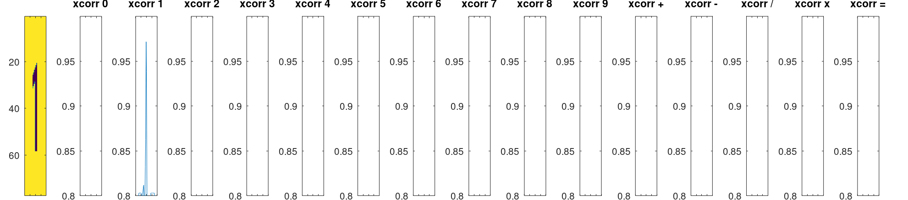

# YT-autoplay-cross-math

A bot to play cross math.
The system consist of 3  individual component

1. A image analyzer that recognizes the game elements from a image.
2. A solver that calculates a solution for solving the puzzle
3. Last something that can apply the above two components to the game running on a phone.

# The game
The game itself is a math puzzle where you need to solve some equations. Below is sample 4 frames from the game at the possible difficulties used to create the image recognizer

```matlab
figure; 
subplot(1,4,1); imshow(imread('images/easy.jpg')); title('Easy');
subplot(1,4,2); imshow(imread('images/medium.jpg')); title('Medium');
subplot(1,4,3); imshow(imread('images/hard.jpg')); title('Hard');
subplot(1,4,4); imshow(imread('images/expert.png')); title('Expert');
print("game-example.png")
```


# Image recognizer
The image recognizer takes an image and spits out the data needed to analyze
- The image solver is made using Octave.
- The templates are created with Octave itself.
- No values was read outside octave, such as colors or positions.

The sequence is the following


## [step0_segment_areas.m](./YTACM-EYE/app/step0_segment_areas.m)
### Detect top and bottom:

### Refine by removing text and circles 


## [step1_find_playfield_method2.m](./YTACM-EYE/app/step1_find_playfield_method2.m)
### Find top grid


## [step2_classify_playfield_box_type.m](./YTACM-EYE/app/step2_classify_playfield_box_type.m)


## [step3_classify_symbols_and_operators.m](./YTACM-EYE/app/step3_classify_symbols_and_operators.m)
This was the most difficult part to get working robustly, in each field we have to find the symbols and combine into a number, I do that by taking the maxim correlation inside each separate region in the field. Response sample below after some filtering to remove mismatches.

- Detection of the symbol '1'

- Detection of the two symbols '1' and '4' inside in field


## [step4_find_variables_rectangles.m](./YTACM-EYE/app/step4_find_variables_rectangles.m)
Detect grid, the detection here, based on a distance transform is super simple. (Most of the code in the file is plotting)


## [step5_classify_available_symbols.m](./YTACM-EYE/app/step5_classify_available_symbols.m)
Classify using same logic as as in step3.

The following is the output
- fieldTypes, 0=bg, 1=input, 2= symbol or operator

Example from using the image 'Easy', the following output is generated (The format is quite verbose but should be readable)

```text
fieldTypes=
   11    6
   0   1   2   2   2   1
   0   0   0   2   0   0
   0   2   0   1   0   0
   2   2   1   2   2   0
   0   2   0   2   0   0
   0   2   0   0   0   0
   0   1   2   1   2   2
   0   0   0   2   0   0
   0   1   2   2   2   2
   0   0   0   2   0   0
   0   0   0   1   0   0
symbolsAtPositions=
21
1,3:+ 
1,4:9 
1,5:= 
2,4:+ 
3,2:22
4,1:3 
4,2:+ 
4,4:= 
4,5:7 
5,2:5 
5,4:27
6,2:= 
7,3:- 
7,5:= 
7,6:2 
8,4:+ 
9,3:+ 
9,4:4 
9,5:= 
9,6:6 
10,4:=
variables_with_pos=
8
1,1:18
1,2:18
1,3:25
1,4:9 
1,5:4 
2,1:29
2,2:2 
2,3:27
```

# Brain
The brain🧠 is used to solve the puzzle🧩 

- Step1, load data
- Step2, detect equations in the matrix (they are just saved as numbers with coordinates and needs to be mapped according to adjacency)
- Step3, Map variables in equations to coordinate system
- Set variables and test for validity, **select equations according to lowest level of freedom to limit test space**

### Optimization note
Selecting according to the lowest level of freedom has a huge effect, the following table shows how the number of visited nodes increased exponentially.
| **Category** | **worst** | **no sorting** | **optimized** | **# variables** |
|--------------|-----------|----------------|---------------|-----------------|
| **expert**   | 2894664   | 854            | 169           | 18              |
| **difficult**| 1747695   | 2336           | 108           | 14              |     
| **medium**   | 3925      | 183            | 40            | 14              |     
| **easy**     | 44        | 44             | 20            | 8               |     


## Solution for easy
 ```time  python solve.py /shared/cross-math-scan-result.txt```
```text
Solution:
[('9+9=18', set()), ('3+4=7', set()), ('27-25=2', set()), ('2+4=6', set()), ('22+5=27', set()), ('9+18=27', set()), ('25+4=29', set())]
{'varname': (0, 5), 'value': '18', 'symIdx': '1,2'}
{'varname': (0, 1), 'value': '9', 'symIdx': '1,4'}
{'varname': (10, 3), 'value': '29', 'symIdx': '2,1'}
{'varname': (2, 3), 'value': '18', 'symIdx': '1,1'}
{'varname': (6, 3), 'value': '25', 'symIdx': '1,3'}
{'varname': (6, 1), 'value': '27', 'symIdx': '2,3'}
{'varname': (8, 1), 'value': '2', 'symIdx': '2,2'}
{'varname': (3, 2), 'value': '4', 'symIdx': '1,5'}

real    0m0.067s
user    0m0.015s
sys     0m0.023s
```

The following diagram shows the path traversed to find the solution


## Solution for medium
```text
Solution:
[('21/3=7', set()), ('18/2=9', set()), ('6+16=22', set()), ('47+19=66', set()), ('14-11=3', set()), ('10+9=19', set()), ('83-27=56', set()), ('23+30=53', set()), ('21+26=47', set()), ('19+8=27', set()), ('23-7=16', set()), ('66-10=56', set()), ('40-18=22', set()), ('11+19=30', set()), ('9-6=3', set())]   
{'varname': (4, 10), 'value': '6', 'symIdx': '2,5'}
{'varname': (4, 2), 'value': '6', 'symIdx': '1,5'}
{'varname': (4, 6), 'value': '22', 'symIdx': '3,2'}
{'varname': (2, 6), 'value': '18', 'symIdx': '2,1'}
{'varname': (2, 10), 'value': '9', 'symIdx': '3,4'}
{'varname': (4, 4), 'value': '16', 'symIdx': '3,3'}
{'varname': (8, 2), 'value': '8', 'symIdx': '2,4'}
{'varname': (2, 2), 'value': '3', 'symIdx': '2,3'}
{'varname': (2, 0), 'value': '21', 'symIdx': '3,1'}
{'varname': (10, 8), 'value': '30', 'symIdx': '1,4'}
{'varname': (10, 4), 'value': '56', 'symIdx': '1,3'}
{'varname': (8, 4), 'value': '10', 'symIdx': '1,1'}
{'varname': (6, 10), 'value': '3', 'symIdx': '1,2'}
{'varname': (6, 4), 'value': '66', 'symIdx': '2,2'}

real    0m0.086s
user    0m0.036s
sys     0m0.024s
```


## Solution for difficult
```text
Solution:
[('28+1=29', set()), ('25+10=35', set()), ('30+17=47', set()), ('18/18=1', set()), ('24-1=23', set()), ('20-3=17', set()), ('2+18=20', set()), ('30/1=30', set()), ('17x1=17', set()), ('22+25=47', set()), ('22x1=22', set()), ('35-12=23', set())]
{'varname': (4, 8), 'value': '22', 'symIdx': '1,4'}
{'varname': (6, 8), 'value': '1', 'symIdx': '2,4'}
{'varname': (6, 6), 'value': '24', 'symIdx': '2,5'}
{'varname': (6, 10), 'value': '23', 'symIdx': '1,2'}
{'varname': (2, 8), 'value': '10', 'symIdx': '2,2'}
{'varname': (2, 10), 'value': '35', 'symIdx': '3,2'}
{'varname': (2, 6), 'value': '25', 'symIdx': '3,3'}
{'varname': (4, 6), 'value': '47', 'symIdx': '1,3'}
{'varname': (4, 2), 'value': '30', 'symIdx': '3,1'}
{'varname': (2, 2), 'value': '1', 'symIdx': '2,1'}
{'varname': (2, 4), 'value': '29', 'symIdx': '1,5'}
{'varname': (4, 4), 'value': '17', 'symIdx': '3,4'}
{'varname': (8, 4), 'value': '17', 'symIdx': '2,3'}
{'varname': (6, 0), 'value': '18', 'symIdx': '1,1'}

real    0m0.057s
user    0m0.030s
sys     0m0.010s
```


## Solution for expert
```text
Solution:
[('11-8=3', set()), ('4+2=6', set()), ('3-2=1', set()), ('21-6=15', set()), ('16-1=15', set()), ('16+7=23', set()), ('118-96=22', set()), ('39/13=3', set()), ('14+21=35', set()), ('11-8=3', set()), ('6x16=96', set()), ('8/4=2', set()), ('15+7=22', set()), ('3-2=1', set()), ('16+23=39', set()), ('6/6=1', set())]
{'varname': (10, 8), 'value': '13', 'symIdx': '1,6'}
{'varname': (10, 6), 'value': '39', 'symIdx': '3,4'}
{'varname': (8, 6), 'value': '23', 'symIdx': '3,3'}
{'varname': (8, 4), 'value': '7', 'symIdx': '2,5'}
{'varname': (8, 2), 'value': '16', 'symIdx': '3,1'}
{'varname': (10, 2), 'value': '96', 'symIdx': '2,4'}
{'varname': (10, 4), 'value': '22', 'symIdx': '3,5'}
{'varname': (6, 10), 'value': '15', 'symIdx': '2,1'}
{'varname': (6, 6), 'value': '16', 'symIdx': '1,2'}
{'varname': (4, 4), 'value': '2', 'symIdx': '1,5'}
{'varname': (4, 2), 'value': '3', 'symIdx': '3,6'}
{'varname': (0, 4), 'value': '8', 'symIdx': '2,6'}
{'varname': (0, 2), 'value': '11', 'symIdx': '1,3'}
{'varname': (4, 8), 'value': '6', 'symIdx': '3,2'}
{'varname': (0, 6), 'value': '3', 'symIdx': '2,3'}
{'varname': (2, 8), 'value': '6', 'symIdx': '2,2'}
{'varname': (2, 6), 'value': '2', 'symIdx': '1,4'}
{'varname': (6, 0), 'value': '21', 'symIdx': '1,1'}

real    0m0.161s
user    0m0.113s
sys     0m0.021s
```

