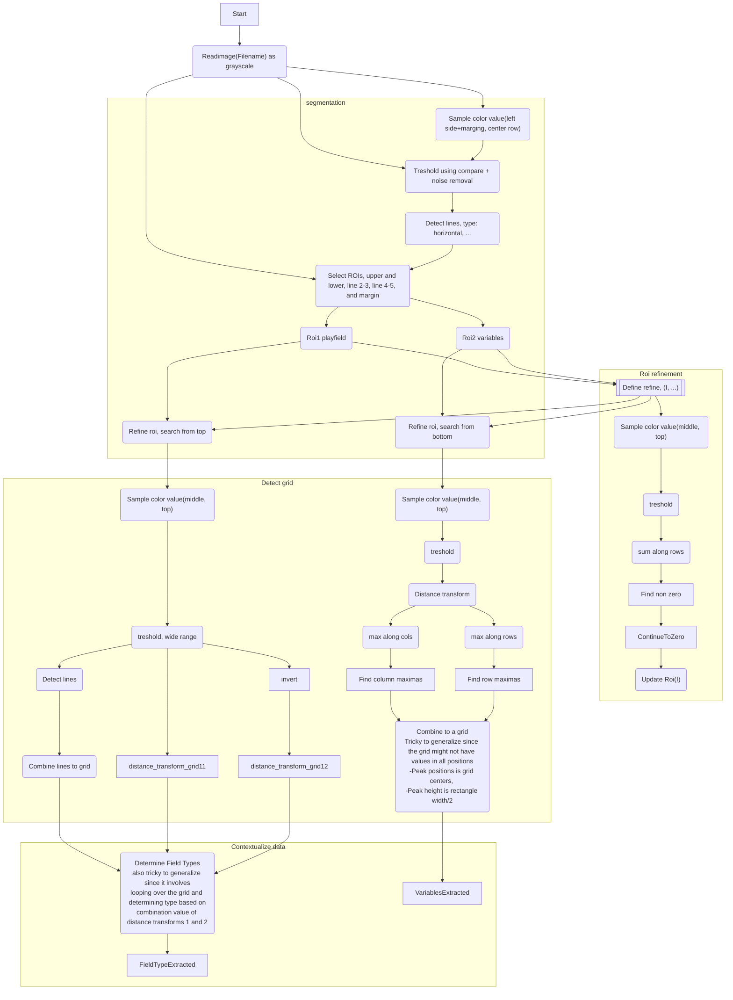

```mermaid 
flowchart TD
Start-->
ReadImage("Readimage(Filename) as grayscale")-->
SampleColorValue("Sample color value(left side+marging, center row)")

ReadImage-->treshold
ReadImage-->split_image

subgraph segmentation
    SampleColorValue-->treshold(treshold)
    treshold("Treshold using compare + noise removal")-->
    detect_lines("Detect lines, type: horizontal, ... ")
    detect_lines-->split_image("Select ROIs, upper and lower, line 2-3, line 4-5, and margin")
    split_image-->Roi1
    split_image-->Roi2
    Roi1("Roi1 playfield")-->Roi1R("Refine roi, search from top")
    Roi2("Roi2 variables")-->Roi2R("Refine roi, search from bottom")
end

Roi1-->def_refine-->Roi1R
Roi2-->def_refine-->Roi2R

subgraph "Roi refinement" 
    def_refine[["Define refine, (I, ...)"]]-->
    SampleColorValue_ref("Sample color value(middle, top)")-->
    threshold_ref(treshold)-->
    Project(sum along rows)-->
    FindNonZero["Find non zero"]-->
    ContinueToZero-->updateRoi("Update Roi(I)")
end

Roi1R-->SampleColorValue_grid1

Roi2R-->SampleColorValue_grid2
subgraph "Detect grid" 
    SampleColorValue_grid2("Sample color value(middle, top)")-->
    threshold_grid2(treshold)-->
    distance_transform_grid2(Distance transform)-->Project_g2r(max along rows)-->findMax_gr["Find row maximas"]
    distance_transform_grid2-->Project_g2c(max along cols)-->findMax_gc["Find column maximas"]
    findMax_gc-->combineToGrid("Combine to a grid\nTricky to generalize since the grid might not have values in all positions\n-Peak positions is grid centers, \n-Peak height is rectangle width/2")
    findMax_gr-->combineToGrid

    SampleColorValue_grid1("Sample color value(middle, top)")---->
    threshold_grid1(treshold, wide range)-->DetecLines_g1("Detect lines")-->
    CombineLinesToGrid("Combine lines to grid")
    

    threshold_grid1-->distance_transform_grid11
    threshold_grid1-->invert-->distance_transform_grid12
   
end
CombineLinesToGrid-->DetermineFieldType
distance_transform_grid11-->DetermineFieldType
distance_transform_grid12-->DetermineFieldType("Determine Field Types\nalso tricky to generalize since it involves\nlooping over the grid and determining type based on\ncombination value of distance transforms 1 and 2 ")

DetermineFieldType-->FieldTypeExtracted
combineToGrid-->VariablesExtracted

subgraph "Contextualize data"
    DetermineFieldType
    VariablesExtracted
    FieldTypeExtracted
end
```